# 🌟 @notyourapple/telegram-stars

> **A production-ready, zero-dependency TypeScript SDK for integrating Telegram Stars payments, balances, transactions, refunds, and payment events into Node.js applications.**

[](https://github.com/Notyourapple/telegram-stars-sdk/actions/workflows/ci.yml)
[](https://github.com/Notyourapple/telegram-stars-sdk/packages)
[](https://www.typescriptlang.org/)
[](https://opensource.org/licenses/MIT)

---

## 📑 Table of Contents

- [Architecture Overview](#-architecture-overview)
- [Payment Workflow](#-payment-workflow)
- [Features](#-features)
- [Installation](#-installation)
- [Quick Start](#-quick-start)
- [Core Concepts](#-core-concepts)
  - [1. Invoices & Links](#1-invoices--links)
  - [2. Pre-Checkout Validation](#2-pre-checkout-validation)
  - [3. Successful Payments](#3-successful-payments)
  - [4. Refunds & Charge IDs](#4-refunds--charge-ids)
- [Advanced Usage](#-advanced-usage)
  - [Subscriptions](#telegram-star-subscriptions)
  - [Balance & Transactions](#checking-stars-balance)
  - [Pagination](#pagination)
- [Error Handling & Retries](#-error-handling--retries)

---

## 🏗 Architecture Overview

The SDK acts as a robust, zero-dependency bridge between your application and the Telegram Bot API, handling complex edge cases, rate limits, and typing automatically.

```mermaid
graph TD
    Client[Node.js Application] -->|Uses| SDK[@notyourapple/telegram-stars]
    SDK -->|Native Fetch| TelegramAPI[Telegram Bot API]
    TelegramAPI -.->|Webhook/Polling| AppServer[Your Webhook Handler]
    AppServer -->|Parses via SDK| Logic[Business Logic]
    
    style SDK fill:#3178c6,color:#fff,stroke:#fff,stroke-width:2px
    style TelegramAPI fill:#2481cc,color:#fff,stroke:#fff,stroke-width:2px
```

---

## 🚀 Payment Workflow

Selling digital goods via Telegram Stars requires handling a specific flow of events. Our SDK makes this simple and type-safe.

```mermaid
sequenceDiagram
    participant U as 👤 Telegram User
    participant T as ✈️ Telegram API
    participant S as 🤖 Your Server / Bot
    
    S->>T: createInvoiceLink(amount: 500 XTR)
    T-->>S: Return Invoice Link
    S->>U: Send Invoice Link Message
    U->>T: Clicks Pay & Confirms
    T->>S: send pre_checkout_query (Webhook)
    
    rect rgb(40, 40, 40)
        Note right of S: Validate Inventory / Stock (Max 10s)
    end
    
    S->>T: approvePreCheckoutQuery(query_id)
    T->>U: Charge User's Stars Balance
    T->>S: send successful_payment (Webhook)
    
    rect rgb(40, 40, 40)
        Note right of S: Fulfill Order & Store Charge ID!
    end
```



---

## ✨ Features

- **Official Telegram Bot API Only**: Mapped strictly to verified methods (`sendInvoice`, `createInvoiceLink`, `answerPreCheckoutQuery`, `refundStarPayment`, etc).
- **Zero Runtime Dependencies**: Powered entirely by native Node.js 20+ global `fetch`, `AbortController`, and `AbortSignal`.
- **Framework-Agnostic**: Works with raw webhooks, HTTP servers (Express, Fastify, Hono), or bot frameworks (grammY, Telegraf). No lock-in.
- **Financial-Grade Mutation Safety**: Payment mutations **never** automatically retry to prevent duplicate charges or inconsistent states.
- **Conservative Retry Engine**: Safe, idempotent read operations automatically retry on 429 rate limits or network errors using bounded exponential backoff with full jitter.
- **Credential Leak Prevention**: Automatic token redaction guarantees bot tokens never enter logs, error messages, stack traces, URLs, or serialized JSON payloads.
- **Streaming Auto-Pagination**: Built-in async iterators handle limits, offsets, and termination conditions securely.

---

## 📦 Installation

**Requirements:** Node.js `20.0.0` or higher, and a Bot Token from [@BotFather](https://t.me/BotFather).

Configure your `.npmrc` to use GitHub Packages:

```ini
@notyourapple:registry=https://npm.pkg.github.com
```

Then install via npm:

```bash
npm install @notyourapple/telegram-stars
```

---

## ⚡ Quick Start

Initialize the client synchronously:

```typescript
import { TelegramStarsClient } from '@notyourapple/telegram-stars';

const stars = new TelegramStarsClient({
  token: process.env.TELEGRAM_BOT_TOKEN!, // Required
});

// Check bot Stars balance
const balance = await stars.balance.get();
console.log(`Bot balance: ${balance.amount} Stars`);
```

---

## 📚 Core Concepts

### 1. Invoices & Links

Telegram Stars digital goods invoices must always specify currency `XTR` and omit the provider token. The SDK handles this automatically.

```typescript
const link = await stars.payments.createInvoiceLink({
  title: 'Rare Game Asset',
  description: 'In-game cosmetic armor',
  payload: 'order_armor_99',
  amount: 500, // Amount in Telegram Stars
  photoUrl: 'https://example.com/assets/armor.png',
});

console.log(`Pay link: ${link}`);
```

### 2. Pre-Checkout Validation

When a user confirms payment, Telegram sends a `pre_checkout_query` update. **Your bot must respond within 10 seconds.**

```typescript
import { isPreCheckoutQueryUpdate, getPreCheckoutQuery } from '@notyourapple/telegram-stars';

async function handleWebhookUpdate(update: unknown) {
  if (isPreCheckoutQueryUpdate(update)) {
    const query = getPreCheckoutQuery(update)!;
    
    // Validate your internal business logic (e.g. check stock)
    const itemAvailable = await checkStock(query.invoice_payload);

    if (itemAvailable) {
      await stars.payments.approvePreCheckoutQuery(query.id);
    } else {
      await stars.payments.rejectPreCheckoutQuery(query.id, 'Out of stock.');
    }
  }
}
```

### 3. Successful Payments

Once Telegram charges the user, a `successful_payment` update arrives:

```typescript
import { isSuccessfulPaymentUpdate, parseSuccessfulPayment } from '@notyourapple/telegram-stars';

async function handleWebhookUpdate(update: unknown) {
  if (isSuccessfulPaymentUpdate(update)) {
    const payment = parseSuccessfulPayment(update)!;

    console.log(`Confirmed! Amount: ${payment.totalAmount} ${payment.currency}`);
    console.log(`Charge ID: ${payment.telegramPaymentChargeId}`);

    // Fulfill digital purchase
    await grantDigitalItem(payment.invoicePayload);
  }
}
```

### 4. Refunds & Charge IDs

> [!IMPORTANT]  
> Always store `telegramPaymentChargeId` in your database. Telegram's API **requires** this ID if you ever need to issue a refund or verify a chargeback dispute.

```typescript
// Refund a payment
await stars.payments.refund({
  userId: customerTelegramUserId,
  telegramPaymentChargeId: savedTelegramPaymentChargeId,
});
```

---

## 🛠 Advanced Usage

### Telegram Star Subscriptions

Telegram supports recurring subscriptions for Stars (30-day periods up to 10,000 Stars).

```typescript
// 1. Create Subscription Link
const subscriptionLink = await stars.payments.createInvoiceLink({
  title: 'VIP Community Subscription',
  description: 'Monthly access to exclusive perks',
  payload: 'sub_vip_monthly',
  amount: 300,
  subscriptionPeriod: 2592000, // Exactly 30 days
});

// 2. Cancel Subscription Extension
await stars.payments.editSubscription({
  userId: customerTelegramUserId,
  telegramPaymentChargeId: subscriptionChargeId,
  isCanceled: true, 
});
```

### Pagination

Use the async generator `stars.transactions.iterate()` to stream transaction records without manual offset management:

```typescript
for await (const tx of stars.transactions.iterate({ batchSize: 50 })) {
  console.log(`Transaction #${tx.id}: ${tx.amount} Stars`);
}
```

---

## 🛡 Error Handling & Retries

The SDK provides a clean, strongly typed error hierarchy (`TelegramConfigurationError`, `TelegramValidationError`, `TelegramNetworkError`, `TelegramRateLimitError`).

```typescript
import { TelegramRateLimitError, TelegramApiError } from '@notyourapple/telegram-stars';

try {
  await stars.payments.refund({ userId, telegramPaymentChargeId });
} catch (error) {
  if (error instanceof TelegramRateLimitError) {
    console.error(`Rate limited. Wait ${error.retryAfter}s before retrying.`);
  } else if (error instanceof TelegramApiError) {
    console.error(`Telegram rejected [${error.errorCode}]: ${error.description}`);
  }
}
```

> [!TIP]
> **Mutation Safety:** Payment mutations (like `refund` or `createInvoice`) are NEVER automatically retried to prevent duplicate actions. Safe read operations (like `getMyStarBalance`) are retried securely with bounded exponential backoff.

---

## 📄 License

[MIT](LICENSE) © 2026 Gaurab Dowerah and Contributors
